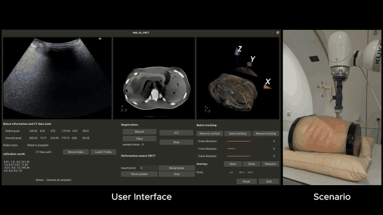
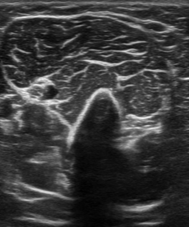
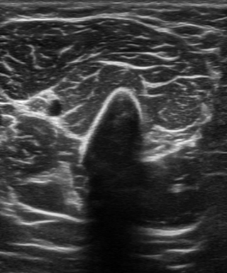
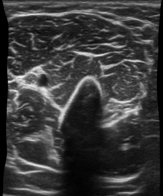
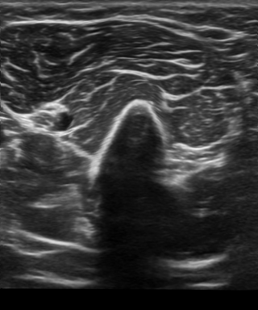
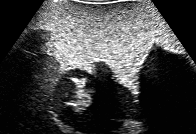
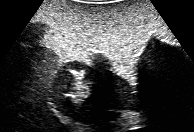
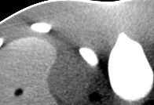
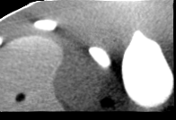
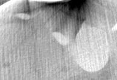

# Robotic Ultrasound Makes CBCT Alive

Official inference code for **"Robotic Ultrasound Makes CBCT Alive"**.

[Paper (MICCAI 2026, Springer)](https://link.springer.com/chapter/10.1007/978-3-032-38236-8_42)

This repository provides a lightweight release of the ultrasound deformation and
deformation-aware CBCT updating pipeline. The model weights are hosted
separately on Hugging Face at
[ziyuan-li/uscorunet](https://huggingface.co/ziyuan-li/uscorunet).

Code repository:
[github.com/ziyuan-li/robotic-us-cbct-updating](https://github.com/ziyuan-li/robotic-us-cbct-updating).

## Demo Video

<a href="assets/robotic_us_cbct_alive.mp4">
  
</a>

[Watch or download the complete MP4 demo](assets/robotic_us_cbct_alive.mp4)

## Overview

USCorUNet estimates dense bidirectional deformation fields between adjacent
ultrasound frames. It combines a ResUNet-style context encoder-decoder with a
shared-weight correlation encoder and local correlation volumes.

This release includes:

- `uscorunet.py`: USCorUNet model definition.
- `infer_us_flow.py`: bidirectional ultrasound deformation inference.
- `infer_cbct_warp_from_us.py`: CBCT slice updating from ultrasound-estimated deformation.
- `infer_utils.py`: image I/O, preprocessing, warping, and checkpoint loading helpers.
- `download_checkpoints.py`: checkpoint downloader for the Hugging Face model repository.
- `examples/`: small ultrasound and ultrasound+CBCT demo cases.
- `assets/`: README media, including the animated preview and complete demo video.

## Installation

Create a Python environment and install the runtime dependencies:

```bash
python -m venv .venv
source .venv/bin/activate
pip install -r requirements.txt
```

On Windows PowerShell:

```powershell
python -m venv .venv
.\.venv\Scripts\Activate.ps1
pip install -r requirements.txt
```

The demos run on CPU, but CUDA is recommended for practical inference speed.

## Checkpoints

Download the model checkpoints into `models/`:

```bash
python download_checkpoints.py
```

If the Hugging Face repository is private, set a read token first:

```bash
export HF_TOKEN=hf_xxx
python download_checkpoints.py
```

On Windows PowerShell:

```powershell
$env:HF_TOKEN="hf_xxx"
python download_checkpoints.py
```

The expected local files are:

| Checkpoint | Local path | Recommended use |
| --- | --- | --- |
| USCorUNet-Base | `models/uscorunet_base.pth` | General ultrasound deformation examples |
| USCorUNet-Probe-Adapted | `models/uscorunet_probe_adapted.pth` | Probe-induced motion and CBCT updating examples |
| USCorUNet-External-Adapted | `models/uscorunet_external_adapted.pth` | External-induced motion examples |

Model weights are distributed from Hugging Face under **CC BY-NC 4.0**.

## Quick Start

### 1. Ultrasound deformation inference

Run USCorUNet on an adjacent ultrasound pair:

```bash
python infer_us_flow.py \
  --input-dir examples/ultrasound/case_02 \
  --checkpoint models/uscorunet_base.pth
```

The script writes:

- `examples/ultrasound/case_02/I1_to_I0.png`: `I1` warped to the `I0` grid.
- `examples/ultrasound/case_02/I0_to_I1.png`: `I0` warped to the `I1` grid.

Additional demo cases:

```bash
python infer_us_flow.py --input-dir examples/ultrasound/case_01 --checkpoint models/uscorunet_base.pth
python infer_us_flow.py --input-dir examples/ultrasound/case_03 --checkpoint models/uscorunet_probe_adapted.pth
python infer_us_flow.py --input-dir examples/ultrasound/case_04 --checkpoint models/uscorunet_probe_adapted.pth
python infer_us_flow.py --input-dir examples/ultrasound/case_05 --checkpoint models/uscorunet_base.pth
```

### 2. Ultrasound-guided CBCT updating

Warp a CBCT slice using the deformation estimated from the ultrasound pair:

```bash
python infer_cbct_warp_from_us.py \
  --case-dir examples/us_cbct/case_01 \
  --checkpoint models/uscorunet_probe_adapted.pth
```

The script writes:

- `examples/us_cbct/case_01/CBCT_I1_pred.png`: predicted CBCT slice at the target time.

You can also run the second demo case:

```bash
python infer_cbct_warp_from_us.py \
  --case-dir examples/us_cbct/case_02 \
  --checkpoint models/uscorunet_probe_adapted.pth
```

## Example Data Layout

### Ultrasound Pair Example

| I0 | I1 | I1 warped to I0 | I0 warped to I1 |
| --- | --- | --- | --- |
|  |  |  |  |

### Ultrasound-Guided CBCT Example

| US at t0 | US at t1 | CBCT at t0 | Predicted CBCT at t1 | CBCT at t1 for comparison |
| --- | --- | --- | --- | --- |
|  |  |  |  |  |

Ultrasound-only cases:

```text
examples/ultrasound/case_XX/
  I0.png
  I1.png
```

Ultrasound+CBCT cases:

```text
examples/us_cbct/case_XX/
  US_I0.png
  US_I1.png
  CBCT_I0.png
  CBCT_I1.png
```

`CBCT_I1.png` is provided for visual comparison only; it is not used as input by
`infer_cbct_warp_from_us.py`.

## Command-Line Options

Both inference scripts accept `--device {auto,cpu,cuda}` and default to `auto`.
CUDA automatic mixed precision is enabled by default on GPU and can be disabled
with `--no-amp`.

To keep inputs untouched, write outputs to a separate directory:

```bash
python infer_us_flow.py \
  --input-dir examples/ultrasound/case_02 \
  --checkpoint models/uscorunet_base.pth \
  --output-dir outputs/ultrasound_case_02
```

## Notes

- The released scripts are intended for inference and reproducible demos.
- Input images are converted to grayscale and normalized to `[0, 1]`.
- Dense flows are predicted in pixel units and applied with `torch.grid_sample`.
- This code and the accompanying model weights are intended for research use only
  and are not approved for clinical use.

## Citation

If you use this code or the USCorUNet checkpoints, please cite:

```bibtex
@inproceedings{li2026robotic,
  title={Robotic Ultrasound Makes CBCT Alive},
  author={Li, Feng and Li, Ziyuan and Jiang, Zhongliang and Navab, Nassir and Bi, Yuan},
  booktitle={International Conference on Medical Image Computing and Computer-Assisted Intervention},
  pages={436--446},
  year={2026},
  organization={Springer}
}
```

## License

The code is released for non-commercial academic research use; see
[`LICENSE`](LICENSE). The USCorUNet checkpoints are hosted separately on Hugging
Face under the **CC BY-NC 4.0** license. For commercial use, please contact the
authors.
